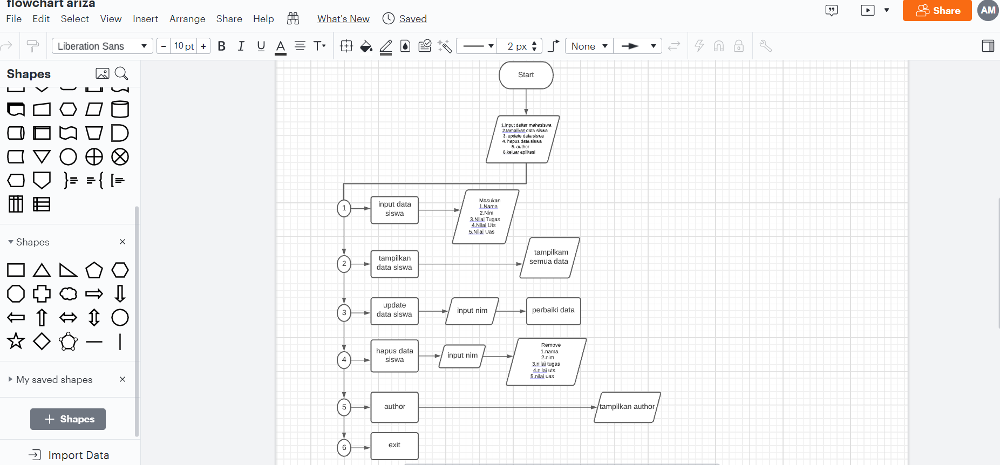

# pert12

A. Tugas Praktikum'

' Buat program sederhana dengan mengaplikasikan penggunaan class. Buatlah class untuk menampilkan daftar nilai mahasiswa, dengan ketentuan: • Method tambah() untuk menambah data • Method tampilkan() untuk menampilkan data • Method hapus(nama) untuk menghapus data berdasarkan nama • Method ubah(nama) untuk mengubah data berdasarkan nama • Buat diagram class, flowchart dan penjelasan programnya pada README.md. • Commit dan push repository ke github'

Program sederhana saja untuk menampung data mahasiswa dengan fungsi-fungsi standar seperti tampil, tambah, edit, dan hapus data. Aplikasi yang akan kita buat belum menggunakan database sebagai media penyimpan data. Jadi datanya hanya disimpan sementara di memory jika aplikasi di tutup maka datanya pun akan hilang. Langkah-langkahnya : Buat kelas untuk menampung data masiswa serta atribut-atributnya. Disini saya hanya menggunakan 5 atribut yaitu nim, nama, tugas, uts, dan uas.

Buat variable untuk menampung list data dari object mahasiswa dan sebuah variable untuk menampung nilai saat user memilih menu

Buat sebuah method untuk menampilkan daftar menu dan fungsi untuk user memilih menu sesuai keinginan.

Dan ini untuk outpunya atau hasulnya

Berikuta adalaha program flowchartnya yang saya buat

Dan ini untuk diagram classnya

